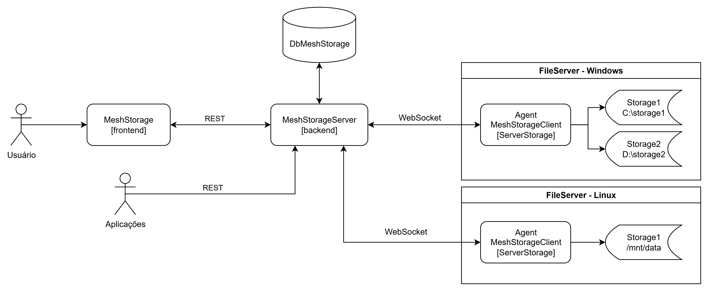

# MeshStorage

MeshStorage é um sistema distribuído inteligente para armazenamento de arquivos, utilizando uma malha de file servers interconectados. 
O servidor central gerencia a disponibilidade e capacidade de cada file server, distribuindo os arquivos de maneira eficiente para otimizar o
uso de espaço e garantir alta disponibilidade.

## 🚀 Visão Geral

O MeshStorage consiste em:
- **MeshStorage Server**: O servidor central que gerencia os file servers, monitora disponibilidade e decide onde armazenar arquivos.
- **MeshStorage Client**: Um cliente (agente) instalado em cada file server, que reporta status ao servidor e recebe comandos de armazenamento.
- **MeshStorage Interface**: Apresentação de um dashboard com informações de storages (armazenamento, clients) total de armazenamento disponível e utilizado, aplicações registradas e quantidade de arquivos registrados.
- **Comunicação em Tempo Real**: Utiliza WebSockets para interação de baixa latência e REST API para operações administrativas.

## 🎯 Recursos Principais

- ✅ Distribuição automática de arquivos entre file servers.
- ✅ Monitoramento de espaço livre e disponibilidade dos file servers.
- ✅ Balanceamento dinâmico baseado em capacidade de armazenamento.
- ✅ Comunicação híbrida (WebSockets + REST API).
- ✅ Alta disponibilidade e escalabilidade.

## 🏗️ Arquitetura



## 📦 Instalação e Configuração

### 🔹 **Requisitos**
- Backend/Client
  - Java 17+
  - Spring Boot 3+
  - WebSockets e REST API habilitados
  - Projetos:
    - [meshstorage-client](meshstorage-client)
    - [meshstorage-common](meshstorage-common)
    - [meshstorage-server](meshstorage-server)
- Frontend
  - .NET8 MVC com Razor
  - Projeto:
    - [meshstorage-frontend](meshstorage-frontend)
- Banco de dados (MySQL ou H2/PostgreSQL no DEV)
- Modelagem do banco de dados (DBDesigner)
  - [Modelo Físico (XML do DBDesigner)](documentos/modelo_meshstorage.xml)
  - [Imagem Modelo Físico](documentos/modelo_meshstorage.png)
  - Scripts:
    - [CREATE Tables - MySQL](documentos/script_create_dbmeshstorage.sql)
    - [DROP Tables - MySQL](documentos/script_drop_tables_dbmeshstorage.sql)

### 🔹 **Passo 1: Clonar o repositório**
```sh
$ git clone https://github.com/eladiojunior/MeshStorage.git
$ cd MeshStorage
```

### 🔹 **Passo 2: Iniciar o Servidor (backend)**
```sh
$ mvn spring-boot:run
```
O servidor inicia na porta `3001`.

### 🔹 **Passo 3: Iniciar os Clientes (Agents)**
Nos file servers, execute:
```sh
$ java -jar meshstorage-client.jar -url-websocket-server ws://localhost:3001/server-storage-websocket -server-name HOSTNAME -storage-name STORAGE_X -storage-path C:\storage\xpto
```
- **Parametros:**\
- **-url-websocket-server** = URL do servidor que irá se conectar ao cliente.
- **-server-name** = Nome do servidor (fileserver) que o cliente está sendo executado, obtido automaticamente, mas pode ser alterado pelo usuário.
- **-storage-name** = Nome do armazenamento (storage) como podemos ter vários clientes sendo executados em uma mesmo servidor, gerado automaticamente, mas pode ser alterado pelo usuário.
- **-storage-path** = Local de armazenamento (path) dos arquivos, dentro do servidor, pode ser um drive (C:, D:, etc.) ou pasta (C:\Temp, /mnt/data, etc.) específica.

### 🔹 **Passo 4: Iniciar o Dashboard (frontend)**
```sh
$ mvn spring-boot:run
```
A aplicação de frontend (dashboard) inicia na porta `3000`.
http://localhost:3000/

## 🌐 Endpoints Principais
### 🔹 REST API 
#### Swagger: http://localhost:3001/swagger-ui/index.html

| Método    | Endpoint                          | Descrição                                                                                 |
|-----------|-----------------------------------|-------------------------------------------------------------------------------------------|
| `GET`     | `api/v1/system/status`            | Verifica o status (saúde) e informações quantitativas do MeshStorage como um todo.        |
| `POST`    | `api/v1/application/register`     | Registrar uma aplicação que irá utilizar o servidor de armazenamento de arquivos físicos. |
| `PUT`     | `api/v1/application/update/{id}`  | Atualizar uma aplicação, pelo ID, para armazenamento de arquivos físicos.                 |
| `GET`     | `api/v1/application/list`         | Lista todas as aplicações para armazenamento de arquivos físicos.                         |
| `DELETE`  | `api/v1/application/remove/{id}`  | Remover (logicamente) uma aplicação do processo de armazemanto de arquivos físicos.       |
| `POST`    | `api/v1/file/upload`              | Registrar um arquivo no ServerStorage.                                                    |
| `GET`     | `api/v1/file/qrcode/{idFile}`     | Obter informações de acesso ao arquivo por link e imagem QR Code.                         |
| `GET`     | `api/v1/file/list`                | Lista os arquivos de uma aplicação (nome) de forma paginada.                              |
| `GET`     | `api/v1/file/listStatusCode`      | Lista os codigos/descrições dos status arquivos do ServerSorage.                          |
| `GET`     | `api/v1/file/link/{token}`        | Baixa um arquivo do ServerStorage por um token de acesso, por link e imagem QR Code.      |
| `GET`     | `api/v1/file/download/{idFile}`   | Baixa um arquivo do ServerStorage pelo identificador do arquivo (chave de acesso).        |
| `DELETE`  | `api/v1/file/delete/{idFile}`     | Remover um arquivo do ServerStorage pelo identificador do arquivo (chave de acesso).      |
| `GET`     | `api/v1/storage/list`             | Lista todos os Server Storages para armazenamento de arquivos físicos.                    |
| `GET`     | `api/v1/storage/best`             | Obter o melhor Server Storage para armazenamento de arquivos físicos.                     |

#### Cabeçalhos de identificação de usuário

| Header            | Obrig? | Exemplo         | Observação                                                   |
|-------------------|--------|-----------------|--------------------------------------------------------------|
| X‑User‑Name        | não¹   | `eladio.junior` | Preenchido automaticamente no caso JWT possua `sub`.         |
| X‑Access‑Channel   | não    | `Mobile`        | `{Site, Mobile, Chat}` – ajuda na segmentação de relatórios. |

¹ Se o usuário é autenticado via JWT/Spring Security, o filtro extrai o `Principal` quando o header vem vazio.

### 🔹 WebSocket (Comunicação em Tempo Real)
- **Conectar:** `ws://localhost:3001/server-storage-websocket`
- **Mensagens suportadas:**
  - ***Servidor***
    - `FILE_REGISTER` → Enviado pelo servidor as informações do arquivo para armazenamento, transmissão fragmentada do conteúdo do arquivo.
    - `FILE_DELETE` → Enviado pelo servidor um identificador de arquivo para remoção.
    - `FILE_DOWNLOAD` → Enviado pelo servidor um identificador de arquivo para download.
  - ***Cliente (Agente)***
    - `status-file-storage` → Enviado pelo agente o resultado do envio do arquivo pelo servidor.
    - `download-file-storage` → Enviado pelo agente as informações do arquivo solicitado, transmissão fragmentada do conteúdo do arquivo.
    - `status-update-client` → Enviado pelo agente a situação do cliente de armazenamento, além de informações como espaço total e disponível em disco.

## 📜 Licença
Este projeto é licenciado sob a **MIT License**.

## ✨ Contato
📧 Email: eladiojunior@gmail.com (Aceito PIX, qualquer valor $$$)